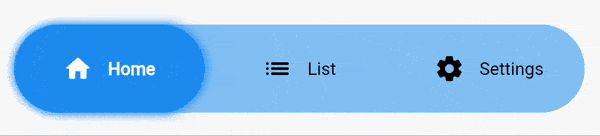

# Segmented Button Slide

<div align="center" style="height: 100px">
  
</div>
<br>
<br>

Segmented Button Slide takes inspiration from the iOS segmented button, adapting it to the Material interface.

### How to use it
Install it by running the following command.
```
flutter pub add segmented_button_slide
```

#### Full example

```dart
int selectedOption = 0;

...

SegmentedButtonSlide(
  entries: const [
    SegmentedButtonSlideEntry(icon: Icons.home_rounded, label: "Home"),
    SegmentedButtonSlideEntry(icon: Icons.list_rounded, label: "List"),
    SegmentedButtonSlideEntry(icon: Icons.settings_rounded, label: "Settings"),
  ], 
  selectedEntry: selectedOption, 
  onChange: (selected) => setState(() => selectedOption = selected),
  colors: SegmentedButtonSlideColors(
    barColor: Colors.grey.withOpacity(0.2),
    backgroundSelectedColor: Colors.grey, 
    foregroundSelectedColor: Colors.white, 
    foregroundUnselectedColor: Colors.black, 
    hoverColor: Colors.grey.withOpacity(0.8)
  ),
  slideShadow: [
    BoxShadow(
      color: Colors.grey,
      blurRadius: 5,
      spreadRadius: 1
    )
  ],
  margin: const EdgeInsets.all(16),
  height: 70,
)
```

#### Detailed explanation
* **[REQUIRED] ``entries``** accepts a list of ``SegmentedButtonSlideEntry``. Each ``SegmentedButtonSlideEntry`` is formed by an icon and a label. You must declare at least one of the two.
* **[REQUIRED] ``selectedEntry``** accepts an ``int``. Defines the item that's currently selected.
* **[REQUIRED] ``onChange``** returns the selected value when the user changes the selection.
* **[REQUIRED] ``colors``** accepts an instance of ``SegmentedButtonSlideColors``. All of it's attributes are mandatory. 
  * ``barColor`` defines the background color of the full bar.
  * ``backgroundSelectedColor`` defines the background color of the item that's currently selected.
  * ``foregroundSelectedColor`` defines the color of the icon and text of the item that's currently selected.
  * ``foregroundUnselectedColor`` defines the color of the icon and text of the items that aren't selected.
  * ``hoverColor`` defines the color of the icon and text when the mouse is over that entry.
* **``slideShadow``** defines the boxShadow of the slider (item that's currently selected).
* **``barShadow``** defines the boxShadow of the full bar (the background).
* **``margin``** creates a margin around the whole widget.
* **``height``** defines the height of the widget.
* **``fontSize``** sets the fontSize of the text. It doesn't affect to the icon.
* **``iconSize``** sets the size of the icon. It doesn't affect to the text.
* **``textOverflow``** defines how the text (only) should overflow.
* **``animationDuration``** defines the duration of all the animations of the widget. By default it's set to 250 milliseconds.
* **``curve``** defines the curve of all the animations of the widget. By default it's set to ``ease``.